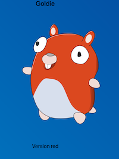
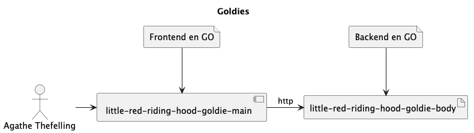

# Hand's-on - Le petit Chaperon rouge se met enfin au Zero Trust



>Bienvenue dans cet atelier intéractif sur la sécurisation des applications dans un environnement Kubernetes, 
>conçu autour du principe du Zero Trust. À travers une métaphore inspirée du conte classique du `Petit Chaperon Rouge`, 
>nous allons explorer comment notre petite goldie rouge ira voir sa mère-grand dans la maison de captain kube en adoptant 
>les meilleures pratiques de sécurité.

## Objectifs

L’objectif de cet atelier est de montrer comment déployer une application Kubernetes tout en garantissant la sécurité 
des communications, la gestion des secrets, et l'authentification. 

Voici ce que nous réaliserons ensemble lors de cette séance :

1. **Déployer une application Kubernetes**
   * `trivy` pour l'analyse des vulnérabilités des images Docker déployées sur le cluster Kubernetes et générer des 
   rapports sur les vulnérabilités trouvées afin d'assurer la sécurité des applications déployées.
   * `linkerd` pour la sécurisation des communications entre les microservices déployés sur le cluster Kubernetes.
   * `vault` pour la gestion des secrets et s'assurer que les applications déployées n'ont pas accès aux secrets 
   auxquels elles n'ont pas le droit d'accéder.
   * `kyverno` pour la mise en place de politiques de validation ce qui permet de garantir que les ressources déployées 
   seront conformes aux normes définies.

2. **Accéder au cluster en toute sécurité**
   * `boundary` pour l'authentification et l'autorisation des utilisateurs pour accèder aux API du cluster Kubernetes.

Nous allons ainsi assurer que notre application fonctionne de manière sécurisée à chaque étape, en intégrant des 
pratiques de sécurité modernes et une approche de Zero Trust.

> ⚠️ **Note**: De nombreux outils de sécurité sont disponibles pour Kubernetes, malheureusement, nous ne pourrons pas 
> tous les couvrir dans cet atelier. Nous avons choisi ceux-ci pour leur simplicité d'utilisation et leur efficacité.
 
## Prérequis

Pour suivre cet atelier, nous vous proposons d'utiliser un cluster Kubernetes que nous avons préparé pour vous. 
Chaque participant aura un accès dédié à un cluster Kubernetes pour réaliser les exercices. Nous vous fournirons le 
fichier de configuration `kubeconfig` pour accéder à votre cluster dédié.

### Source des ressources
Nous vous convions à cloner ce dépôt Git pour accéder aux ressources nécessaires pour réaliser les exercices.

```bash
git clone https://github.com/SphinxGaia/little-red-riding-hood.git
git switch lab-devfest-nantes
cd little-red-riding-hood
```

### Récupération de l'image de tooling
Nous avons préparé une image Docker contenant tous les outils nécessaires pour réaliser les exercices. 

> **Note**: Vous pouvez bien entendu utiliser les outils sur votre machine locale, mais nous vous recommandons d'utiliser l'image Docker pour
avoir une expérience homogène.

Cette image est disponible sur le registre GitHub Container Registry. Vous pouvez la récupérer en exécutant la 
commande suivante :

```bash
docker pull ghcr.io/ddrugeon/little-red-riding-hood-tooling:latest
```

### Récupération du fichier de configuration `kubeconfig`
Nous avons préparé un serveur Vault pour pouvoir stocker le fichier de configuration `kubeconfig` pour accéder à votre 
cluster Kubernetes dédié.

Dans un premier temps, vous devez stocker le token d'accès à Vault dans un fichier local `montoken-vault.txt`. Ce token
 vous sera fourni par les organisateurs de l'atelier.

```bash
export MONCLUSTER="<number>"

docker container run -it --rm ghcr.io/ddrugeon/little-red-riding-hood-tooling:latest -c "curl -s    --request POST     --data '{\"password\":\"vcluster-app$MONCLUSTER\"}' http://vault.aws.sphinxgaia.jeromemasson.fr/v1/auth/userpass/login/vcluster-app$MONCLUSTER | jq -r .auth.client_token" > montoken-vault.txt
```

Ensuite, exécuter les commandes suivantes pour récupérer votre fichier de configuration `kubeconfig` :

```bash
curl -H "X-Vault-Request: true" -H "X-Vault-Token: $(cat montoken-vault.txt)" http://vault.aws.sphinxgaia.jeromemasson.fr/v1/auth/token/lookup-self

docker container run -it --rm ghcr.io/ddrugeon/little-red-riding-hood-tooling:latest -c "curl --silent -H \"X-Vault-Request: true\" -H \"X-Vault-Token: $(cat montoken-vault.txt)\" http://vault.aws.sphinxgaia.jeromemasson.fr/v1/vclusters/data/vcluster-app$MONCLUSTER | jq .data.data.kubeconfig | base64 -d" > kubeconfig
```

> ⚠️ **Note**: Remplacez `<moncluster-name>` par le nom de votre cluster Kubernetes dédié.
 
### Accès au cluster Kubernetes
Pour accéder à votre cluster Kubernetes, vous devez définir la variable d'environnement `KUBECONFIG` pour pointer vers 
votre fichier de configuration `kubeconfig`.

```bash
export REPO_ROOT_DIR=$(pwd)
export KUBECONFIG=$(pwd)/kubeconfig
```

Lancer un container Docker avec l'image de tooling pour tester l'accès à votre cluster Kubernetes.

```bash
docker run --rm -v $KUBECONFIG:/home/tooling/.kube/config -v $REPO_ROOT_DIR/labs:/apps/labs -it ghcr.io/ddrugeon/little-red-riding-hood-tooling:latest
```

Testez l'accès à votre cluster Kubernetes en exécutant la commande suivante :

```bash
kubectl cluster-info
```

Vous devriez voir les informations de votre cluster Kubernetes s'afficher.

## Architecture de l'application



L'application d'exemple est simple. Elle est composée d'un frontend en GO qui sert une page HTML. Cette derniére est construite en appelant un backend lui aussi aussi en GO.

## Règles du Jeu

Dans un premier temps, vous devez déployer l'application [red riding hood v1](labs/manifests/01-red-riding-hood-v1/) puis
ajouter différentes couches de sécurité sur votre cluster pour rendre notre application plus sûre.

Créez un namespace `red` pour déployer l'application `red riding hood v1`.

```bash
kubectl create namespace red
```

Avant de déployer l'application, vous devez ajouter un label sur au moins un des noeuds du cluster pour qu'il puisse
être schédulé sur ce noeud. Vous pouvez utiliser la commande suivante pour ajouter un label `red-archi=enabled` sur un 
des noeuds.

Lister les noeuds existants:
```bash
kubectl get nodes -o custom-columns=NAME:{.metadata.name}
```

Puis sélectionner un noeud et ajouter le label `red-archi=enabled` sur ce noeud.

```bash
kubectl label nodes <node-name> red-archi=enabled
```

Modifier le fichier de configuration `manifest-red.yaml` pour définir l'URL de l'application `red riding hood v1`
dans le champ `spec.ingress.host`. Remplacer `vcluster-test-red.aws.sphinxgaia.jeromemasson.fr` par l'URL de votre
cluster Kubernetes dédié à savoir `vcluster-app<number>-red.aws.sphinxgaia.jeromemasson.fr` où <number> correspond au
 numéro de votre cluster dédié. Déployez l'application `red riding hood v1` dans le namespace `red`.

```bash
kubectl apply -f labs/manifests/01-red-riding-hood-v1/manifest-red.yaml -n red
```

Vous pouvez accéder à l'application en exécutant la commande suivante :

```bash
curl -H "Host: vcluster-app<number>-red.aws.sphinxgaia.jeromemasson.fr" http://vcluster-app<number>-red.aws.sphinxgaia.jeromemasson.fr
```

> **Note**: Si vous ne pouvez pas accéder à votre site, vous pouvez faire un reset du cache DNS de votre machine.

Une fois la version 1 déployée, nous allons ajouter petit à petit des couches de sécurité pour rendre notre application
plus sûre.

## Exercices
Pour obtenir une version dite "zero trust" de votre cluster, nous vous conseillons de suivre l'ordre des déploiements et 
en particulier de faire l'étape `boundary` en dernier.

## 01 - Trivy


Trivy est un scanner de vulnérabilités open-source spécialement conçu pour les environnements de conteneurisation
tels que Kubernetes. Il peut être utilisé pour analyser les images de conteneurs avant leur déploiement sur un
cluster Kubernetes, afin de détecter les vulnérabilités connues et les erreurs de configuration de sécurité.

Généralement intégré dans la chaine de CI/CD pour vérifier les vulnérabilités lors de la construction d'une image, nous
pouvons pour empêcher le déploiement de conteneurs sur un cluster Kubernetes en utilisant des politiques de validation
d'admission. 

Il n'est pas rare qu'une image Docker ne comporte pas de failles de sécurité le jour de sa construction
mais de nouvelles vulnérabilités peuvent apparaître au moment du déploiement sur notre cluster. Nous vous proposons donc
d'installer Trivy pour scanner les images lors du déploiement sur le cluster. Nous utiliserons cet outil pour vérifier
les images déployées sur notre cluster et générer des rapports sur les vulnérabilités trouvées.

[Step Trivy](labs/01-trivy-scanner/README.md)

## 02 - Vault


Hashicorp Vault est un outil open-source de gestion des secrets qui permet de stocker, gérer et distribuer des 
informations sensibles telles que les mots de passe, les certificats et les clés d'API dans un environnement Kubernetes.

Il offre des fonctionnalités avancées pour la gestion des secrets, comme leur rotation automatique et la gestion 
des certificats, et peut être intégré à Kubernetes en tant que fournisseur d'identité pour permettre aux applications de
s'authentifier et d'accéder aux secrets stockés.

Par défaut, les secrets sont stockés en clair dans les fichiers de configuration Kubernetes, ce qui peut poser des
problèmes de sécurité. Des solutions comme Vault permettent de stocker les secrets de manière sécurisée et de les
distribuer aux applications de manière sécurisée au moment de leur démarrage. Nous utiliserons Vault pour contrôler
l'accès aux secrets stockés dans le cluster Kubernetes uniquement aux applications qui en ont besoin.

[Step Vault](labs/02-vault/README.md)


## 03 - Linkerd


Par défaut, toutes les communications entre les microservices déployés sur un cluster Kubernetes sont non sécurisées. Les
communications sont en clair et peuvent être interceptées par des attaquants.

Linkerd est un service mesh open-source qui permet entre autres de sécuriser les communications entre les microservices 
déployés sur un cluster Kubernetes. Ainsi, nous utiliserons les capacités de Linkerd pour chiffrer les communications
entre nos différents microservices et garantir la confidentialité et l'intégrité des données échangées. Nous explorerons
également les fonctionnalités de monitoring et de traçabilité de Linkerd pour surveiller les golden métriques de nos
microservices.

[Step Linkerd](labs/03-linkerd/README.md)

### 04 - Kyverno - Moteur de Politique pour Kubernetes


Kyverno est un moteur de politique open-source pour Kubernetes qui automatise la gestion et l'application de politiques
de sécurité, de conformité et opérationnelles dans un cluster Kubernetes. Il permet aux administrateurs de cluster de
définir des politiques de manière déclarative et de les appliquer automatiquement à toutes les demandes entrantes et
sortantes dans le cluster. Les politiques peuvent être définies à l'aide de ressources personnalisées Kubernetes ou
de fichiers YAML, et peuvent être appliquées au niveau du namespace ou du cluster.

Nous vous proposons d'installer Kyverno sur le cluster pour définir une politique de sécurité pour interdire certains
déploiements sur votre cluster.

[Step Kyverno](labs/04-kyverno/README.md)

## 05 - Boundary


Hashicorp Boundary est un produit open-source qui fournit une solution de gestion des accès sécurisée pour les systèmes,
les applications et les infrastructures. Il permet de créer des sessions d'accès sécurisées pour les utilisateurs et 
les applications, en contrôlant finement les autorisations et les ressources accessibles.

Actuellement, l'API du cluster Kubernetes est ouverte sur internet. Nous vous proposons de sécuriser cette API
grâce à Boundary. Nous pourrons enfin avoir un journal d'audit traçant tous les appels à l'api du cluster et savoir
qui y accède et surtout quelles actions sont faites sur notre cluster.

[Step Boundary](labs/05-boundary/README.md)

# Conclusion

À travers notre aventure inspirée du conte du Petit Chaperon Rouge, nous avons appris à naviguer dans un royaume 
technologique complexe, où la sécurité et la conformité des applications sont primordiales. Grâce aux différents outils 
tels que HashiCorp Boundary, Kyverno, Trivy, Vault et Linkerd, nous avons renforcé notre infrastructure Kubernetes, 
protégeant ainsi nos précieux secrets des dangers invisibles du loup.

Tout comme Goldie Rouge a su se prémunir contre les dangers en s'appuyant sur la sagesse de Mère Grand, vous avez 
maintenant acquis les compétences nécessaires pour sécuriser vos applications et garantir des communications chiffrées. 
En intégrant ces outils dans votre environnement, vous êtes devenus les gardiens de votre royaume numérique, prêts à 
faire face aux menaces et à assurer la tranquillité d'esprit de tous les habitants du village.

Néanmoins, les aventures de notre petite Goldie ne fait que commencer dans le monde du Zero Trust. De nombreux autres
dangers et défis l'attendent, mais avec votre aide, elle pourra surmonter tous les obstacles et protéger son royaume.

Nous espérons que cet atelier vous a plu et que vous avez apprécié cette aventure dans le monde du Zero Trust. 
N'hésitez pas à nous donner un feedback sur cet atelier et à partager vos expériences avec nous.
