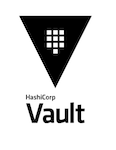

# Exercice 02 : Utilisation de Vault pour l'Injection Dynamique de Secrets



Dans un village paisible, Mère Grand protégeait jalousement ses secrets, dissimulant ses digicodes d'entrée dans un 
coffre-fort. Pour assurer sa sécurité, elle savait qu'elle devait éviter que le maléfique loup, toujours en quête 
d'aventures malicieuses, ne mette la main sur ses précieuses informations. Avec l'aide de l'innocente Goldie Rouge, 
la seule autorisée à pénétrer dans le sanctuaire de Mère Grand, ils décidèrent de renforcer la protection de ces secrets 
vitaux.

Ainsi, ce voyage nous invite à découvrir l'univers de Vault, un outil puissant pour stocker des secrets de façon 
sécurisée. À travers cet exercice, vous apprendrez à configurer Vault pour garantir que seules les personnes autorisées 
peuvent accéder aux informations sensibles, tout en empêchant le loup de contrecarrer les plans de Mère Grand. 

Ensemble, nous prendrons des mesures pour renforcer la sécurité de vos applications dans un environnement Kubernetes, 
assurant ainsi la tranquillité d'esprit de tous.

## But de l'Exercice
L'objectif de cet exercice est de configurer Vault pour stocker des secrets, établir des politiques d'accès, et déployer
une application Kubernetes qui peut récupérer ces secrets de manière sécurisée.

## Pourquoi utiliser Vault ?

HashiCorp Vault est un système de gestion des secrets qui permet de stocker et de contrôler l'accès aux informations 
sensibles. En intégrant Vault dans votre infrastructure Kubernetes, vous pourrez automatiser le traitement des secrets, 
ce qui réduit les risques d'exposition accidentelle et permet de gérer les accès de manière granulaire. Vault vous aide 
également à répondre aux exigences de sécurité et de conformité en vous permettant de contrôler qui peut accéder à quoi 
et quand.

## Installation

Pour commencer l'installation de Vault, nous allons utiliser l'image Docker de tooling fournie.

### Étapes d'Installation
1. Configuration de l'environnement :
Exécutez les commandes suivantes pour préparer votre environnement :

```bash
export REPO_ROOT_DIR=$(pwd)
export KUBECONFIG=$(pwd)/kubeconfig
docker run --rm -v $KUBECONFIG:/home/tooling/.kube/config -v $REPO_ROOT_DIR/labs:/labs -it ghcr.io/ddrugeon/little-red-riding-hood-tooling:latest
```

2. Naviguer vers le répertoire de configuration de Vault :
Changez de répertoire pour accéder à la configuration de Vault :

```bash
cd /labs/02-vault
```

3. Installer Vault via Helm :
Ajoutez le dépôt Helm de HashiCorp et installez Vault :

```bash
helm repo add hashicorp https://helm.releases.hashicorp.com
helm repo update
```
4. Créez le namespace pour Vault :

```bash
kubectl create namespace vault
```

Puis installez Vault :

```bash
helm upgrade --install vault hashicorp/vault -n vault -f override.yaml
```

### Unseal du Vault
Notre serveur Vault est opérationnel, mais il doit être "descellé" (unseal). Voici les étapes à suivre :

1. Accéder au conteneur Vault :
Lancez un conteneur pour utiliser la CLI de Vault :

```bash
kubectl exec -n vault vault-0 -it -- sh
```
2. Initialiser et désceller Vault :
À l'intérieur du conteneur, exécutez les commandes suivantes :

```bash
cd /home/vault
export VAULT_ADDR="http://127.0.0.1:8200"
vault operator init -key-shares=1 -key-threshold=1 > key-vault.txt
sleep 2
vault operator unseal $(grep 'Key 1:' key-vault.txt | awk '{print $NF}')
sleep 2
vault login $(grep 'Initial Root Token:' key-vault.txt | awk '{print $NF}')
```

### Création d'un Dépôt de Secrets
1. Créez un chemin dans Vault où seront stockés les secrets :

```bash
vault secrets enable -path=little-red kv-v2
vault secrets list -detailed
```

2. Définir une Politique d'Accès :
Créez une politique qui permettra d'accéder au secret grand-ma-secret :

```bash
cat <<EOF > little-red-policy.hcl
path "little-red/data/grand-ma-secret" { capabilities = ["read"] }
EOF

vault policy write little-red little-red-policy.hcl
```
3.Activez l'authentification Kubernetes dans Vault et définissez un rôle :

```bash
vault auth enable kubernetes
vault write auth/kubernetes/config kubernetes_host="https://$KUBERNETES_PORT_443_TCP_ADDR:443"
vault write auth/kubernetes/role/little-red \
    bound_service_account_names=red-little-red-riding-hood-goldie-body \
    bound_service_account_namespaces=red \
    policies=little-red ttl=24h
```

### Ajout d'un Secret
1. Ajoutez un secret dans le chemin configuré :

```bash
vault kv put little-red/grand-ma-secret bobinette=pull
```

2. Quittez le conteneur Vault :

```bash
exit
```

### Déploiement de l'Application et Injection des Secrets
Accéder au Répertoire de l'Application :

```bash
cd /labs/02-vault/manifests/
```
> **Note** : Modifiez le manifeste static/manifest-wolf.yaml pour correspondre à votre nom de cluster, 
> notamment pour les lignes d'ingress.

1. Déployez l'application du Loup :

```bash
kubectl apply -f manifest-wolf.yaml
```
2. Vérifiez que le déploiement s'est effectué correctement :

```bash
kubectl get deploy -n red
```

3. Configurer l'Injection des Secrets :
Pour activer l'injection des secrets depuis Vault, nous allons ajouter les annotations suivantes au déploiement :

```yaml
spec:
  template:
    metadata:
      annotations:
        vault.hashicorp.com/agent-inject: 'true'
        vault.hashicorp.com/role: 'little-red'
        vault.hashicorp.com/agent-grand-ma-secret.txt: 'little-red/data/grand-ma-secret'  
```

Appliquez le patch pour les ajouter au déploiement :

```bash
kubectl patch deployment -n red little-red-riding-hood-goldie-body --patch-file patch.yaml
```


5. Vérifier l'État du Déploiement :

```bash
kubectl get deploy -n red
```

6.Vérifier les Logs du Pod :
Examinez les logs du pod pour identifier les éventuelles erreurs :

```bash
kubectl logs little-red-riding-hood-goldie-body-xxx -n red -c vault-agent-init
```

### Finalisation du Déploiement
Pour permettre l'accès au secret pour le bon service account, appliquez le manifeste success/manifest-red.yaml :

```bash
kubectl apply -f manifest-red.yaml
```

Répétez l'injection de configuration depuis Vault :

```bash
kubectl patch deployment -n red little-red-riding-hood-goldie-body --patch "$(cat patch.yaml)"
```

Vérifiez une dernière fois l'état du déploiement :

```bash
kubectl get deploy -n red
kubectl logs deployments/little-red-riding-hood-goldie-main -n red
kubectl logs deployments/little-red-riding-hood-goldie-body -n red
```


## Conclusion
En configurant Vault, vous avez instauré une méthode sécurisée pour stocker et accéder aux secrets sensibles dans votre 
environnement Kubernetes. Grâce à Vault, vous avez établi un mécanisme d'injection dynamique de secrets qui réduit les 
risques d'exposition ainsi que les erreurs humaines. Vous êtes désormais armés pour gérer les secrets de manière 
centrale et sécurisée, tout en permettant un accès contrôlé aux applications qui en ont besoin.

> Comme Mère Grand a réussi à s’assurer que seul le Petit Chaperon Rouge pouvait accéder à ses trésors cachés, vous 
> avez mis en place un coffre-fort numérique à l'aide de Vault, veillant à ce que les secrets restent bien protégés 
> des griffes du loup.
 
Suite de l'aventure : [03 - Service Mesh avec Linkerd](../03-linkerd/README.md)